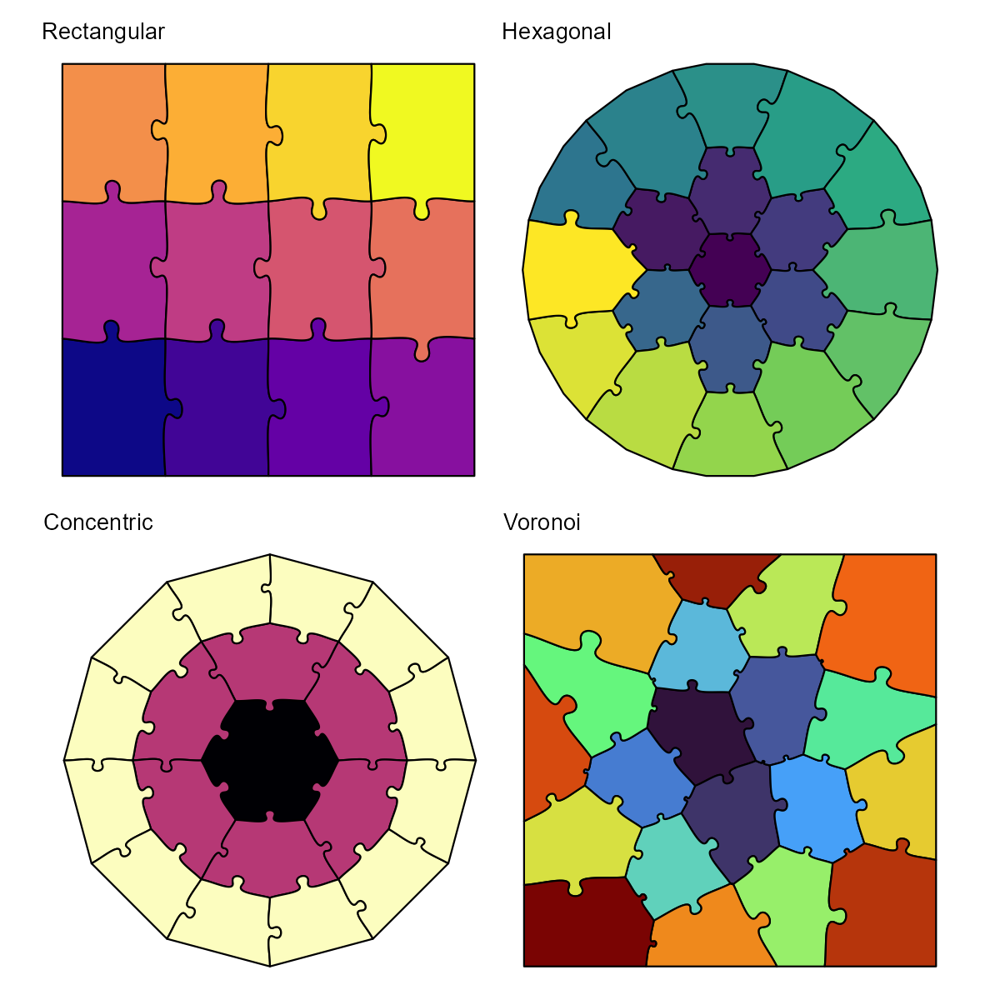
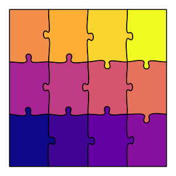
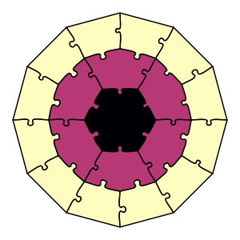
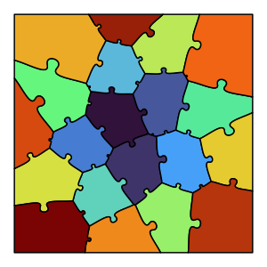
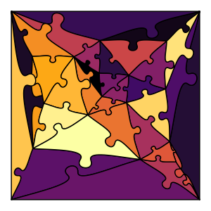

# jigsawR

> Generate beautiful, mathematically-precise jigsaw puzzles in R

[](https://github.com/pjt222/jigsawR/actions/workflows/R-CMD-check.yaml)
[](https://www.gnu.org/licenses/gpl-3.0)
[](https://pjt222.github.io/jigsawR)

<p align="center">
  
</p>

## Features

- **6 Puzzle Types**: Rectangular, hexagonal, concentric, voronoi, random, and SNIC
- **ggplot2 Integration**: Use `geom_puzzle_*()` functions in your plots
- **PILES Notation**: Fuse pieces together with intuitive syntax
- **Reproducible**: Same seed = same puzzle, every time
- **Manufacturing-Ready**: Export individual SVG pieces for laser cutting
- **Interactive App**: Shiny app for live preview and downloads

## Quick Start

```r
# Install from GitHub
devtools::install_github("pjt222/jigsawR")

# Generate your first puzzle
library(jigsawR)
puzzle <- generate_puzzle(
  type = "hexagonal",
  grid = c(3),
  seed = 42
)

# View the SVG
cat(puzzle$svg_content)
```

<p align="center">
  
</p>

## ggplot2 Integration

Create stunning puzzle visualizations with familiar ggplot2 syntax:
```r
library(ggplot2)
library(jigsawR)

ggplot() +
  geom_puzzle_rect(
    aes(fill = after_stat(piece_id)),
    cols = 5, rows = 4, seed = 123
  ) +
  scale_fill_viridis_c(option = "turbo") +
  coord_fixed() +
  theme_void()
```

<p align="center">
  
</p>

## Quick Parameter Reference

| Parameter | Default | Unit | Description |
|-----------|---------|------|-------------|
| `type` | "rectangular" | - | Puzzle type: rectangular, hexagonal, concentric, voronoi, random, snic |
| `grid` | c(3, 4) | - | Rows × cols (rect), rings (hex/conc), or cell count (voronoi/random) |
| `size` | c(400, 300) | mm | Width × height (rect) or diameter (hex/conc) |
| `seed` | random | - | Integer for reproducibility |
| `tabsize` | 6 | % | Tab size as percentage of edge length |
| `jitter` | 2 | % | Random variation in tab shape |
| `offset` | 0 | mm | Piece separation (0 = complete puzzle) |
| `layout` | "grid" | - | Layout algorithm: "grid" or "repel" |

**Type-specific:**
- **Hexagonal**: `do_warp`, `do_trunc`, `do_circular_border`
- **Concentric**: `center_shape` ("hexagon"/"circle"), `boundary_facing`
- **Voronoi**: `point_distribution` ("fermat"/"uniform"/"jittered")
- **Random**: `n_corner` (3-8 for base polygon shape)
- **SNIC**: `image_path`, `compactness`, `n_superpixels`

See the [full API reference](https://pjt222.github.io/jigsawR/api/generate-puzzle.html) for all parameters.

## Gallery

| Rectangular | Hexagonal | Concentric | Voronoi | Random | SNIC |
|:-----------:|:---------:|:----------:|:-------:|:------:|:----:|
|  |  |  |  |  |  |

[View full gallery](https://pjt222.github.io/jigsawR/gallery/rectangular.html)

## Documentation

- [Getting Started](https://pjt222.github.io/jigsawR/getting-started.html)
- [API Reference](https://pjt222.github.io/jigsawR/api/generate-puzzle.html)
- [Tutorials](https://pjt222.github.io/jigsawR/tutorials/basic-usage.html)
- [Live Shiny App](https://pjt222.shinyapps.io/jigsawR)

## Installation

```r
# From GitHub (recommended)
devtools::install_github("pjt222/jigsawR")

# With all optional dependencies
devtools::install_github("pjt222/jigsawR", dependencies = TRUE)
```

### Requirements

- **R**: 4.0 or higher
- **Core packages**: ggplot2, ggfx, viridis
- **Optional**: rsvg, magick (for PNG conversion)

## Contributing

Contributions welcome! Check out the [open issues](https://github.com/pjt222/jigsawR/issues) for ideas.

## Credits

- **Original Algorithm**: [Draradech's JavaScript implementation](https://github.com/Draradech/jigsaw) (CC0)
- **R Translation**: [Philipp Thoss](https://github.com/pjt222)

## License

jigsawR is dual-licensed:

- **Open Source (GPL-3)**: Free for personal, academic, and open-source use
- **Commercial License**: Contact ph.thoss@gmx.de for proprietary use
