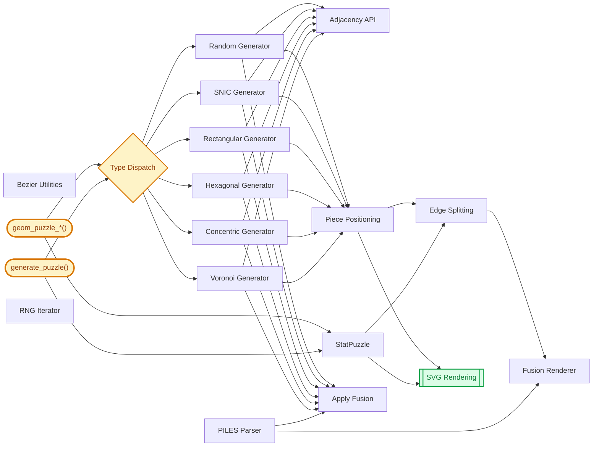

```mermaid
flowchart LR
    adjacency["Adjacency API"]
    bezier_utils["Bezier Utilities"]
    geom_puzzle(["geom_puzzle_*()"])
    generate_puzzle(["generate_puzzle()"])
    positioning["Piece Positioning"]
    piles_parser["PILES Parser"]
    rand_gen["Random Generator"]
    edge_split["Edge Splitting"]
    fusion_render["Fusion Renderer"]
    svg_render[["SVG Rendering"]]
    rng_iter["RNG Iterator"]
    snic_gen["SNIC Generator"]
    stat_puzzle["StatPuzzle"]
    type_dispatch{"Type Dispatch"}
    rect_gen["Rectangular Generator"]
    hex_gen["Hexagonal Generator"]
    conc_gen["Concentric Generator"]
    apply_fusion["Apply Fusion"]
    vor_gen["Voronoi Generator"]

    %% Connections
    rand_gen --> adjacency
    snic_gen --> adjacency
    rect_gen --> adjacency
    hex_gen --> adjacency
    conc_gen --> adjacency
    vor_gen --> adjacency
    rand_gen --> positioning
    snic_gen --> positioning
    rect_gen --> positioning
    hex_gen --> positioning
    conc_gen --> positioning
    vor_gen --> positioning
    type_dispatch --> rand_gen
    positioning --> edge_split
    stat_puzzle --> edge_split
    edge_split --> fusion_render
    piles_parser --> fusion_render
    positioning --> svg_render
    stat_puzzle --> svg_render
    type_dispatch --> snic_gen
    geom_puzzle --> stat_puzzle
    generate_puzzle --> stat_puzzle
    geom_puzzle --> type_dispatch
    generate_puzzle --> type_dispatch
    type_dispatch --> rect_gen
    type_dispatch --> hex_gen
    type_dispatch --> conc_gen
    rand_gen --> apply_fusion
    snic_gen --> apply_fusion
    rect_gen --> apply_fusion
    hex_gen --> apply_fusion
    conc_gen --> apply_fusion
    vor_gen --> apply_fusion
    piles_parser --> apply_fusion
    type_dispatch --> vor_gen

    %% Styling
    classDef outputStyle fill:#dcfce7,stroke:#16a34a,stroke-width:2px,color:#15803d
    class svg_render outputStyle
    classDef decisionStyle fill:#fef3c7,stroke:#d97706,stroke-width:2px,color:#92400e
    class type_dispatch decisionStyle
    classDef startStyle fill:#fef3c7,stroke:#d97706,stroke-width:3px,color:#92400e
    class geom_puzzle startStyle
    class generate_puzzle startStyle
```
