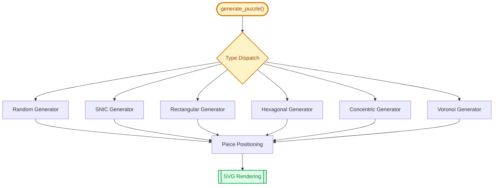

```mermaid
flowchart TD
    generate_puzzle(["generate_puzzle()"])
    positioning["Piece Positioning"]
    rand_gen["Random Generator"]
    svg_render[["SVG Rendering"]]
    snic_gen["SNIC Generator"]
    type_dispatch{"Type Dispatch"}
    rect_gen["Rectangular Generator"]
    hex_gen["Hexagonal Generator"]
    conc_gen["Concentric Generator"]
    vor_gen["Voronoi Generator"]

    %% Connections
    rand_gen --> positioning
    snic_gen --> positioning
    rect_gen --> positioning
    hex_gen --> positioning
    conc_gen --> positioning
    vor_gen --> positioning
    type_dispatch --> rand_gen
    positioning --> svg_render
    type_dispatch --> snic_gen
    generate_puzzle --> type_dispatch
    type_dispatch --> rect_gen
    type_dispatch --> hex_gen
    type_dispatch --> conc_gen
    type_dispatch --> vor_gen

    %% Styling
    classDef outputStyle fill:#dcfce7,stroke:#16a34a,stroke-width:2px,color:#15803d
    class svg_render outputStyle
    classDef decisionStyle fill:#fef3c7,stroke:#d97706,stroke-width:2px,color:#92400e
    class type_dispatch decisionStyle
    classDef startStyle fill:#fef3c7,stroke:#d97706,stroke-width:3px,color:#92400e
    class generate_puzzle startStyle
```
